# Architecture Diagrams

This document contains visual representations of the system architecture using Mermaid diagrams. These diagrams help understand the structure, data flow, and relationships within the application.

## Table of Contents

1. [High-Level System Architecture](#1-high-level-system-architecture)
2. [Frontend Architecture](#2-frontend-architecture)
3. [Backend Architecture](#3-backend-architecture)
4. [Database Schema](#4-database-schema)
5. [Authentication Flow](#5-authentication-flow)
6. [Amazon Article Pipeline Flow](#6-amazon-article-pipeline-flow)
7. [Content Generation Flow](#7-content-generation-flow)
8. [Deployment Architecture](#8-deployment-architecture)
9. [API Integration Map](#9-api-integration-map)
10. [Data Flow Diagrams](#10-data-flow-diagrams)

---

## 1. High-Level System Architecture

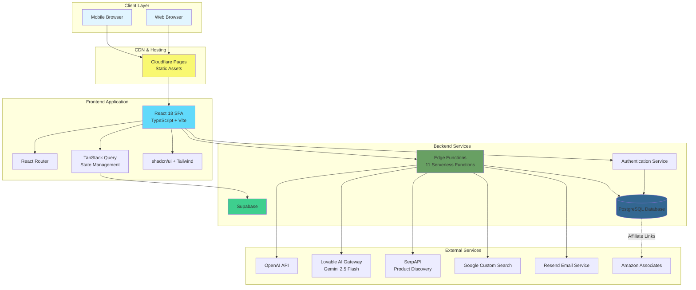

---

## 2. Frontend Architecture

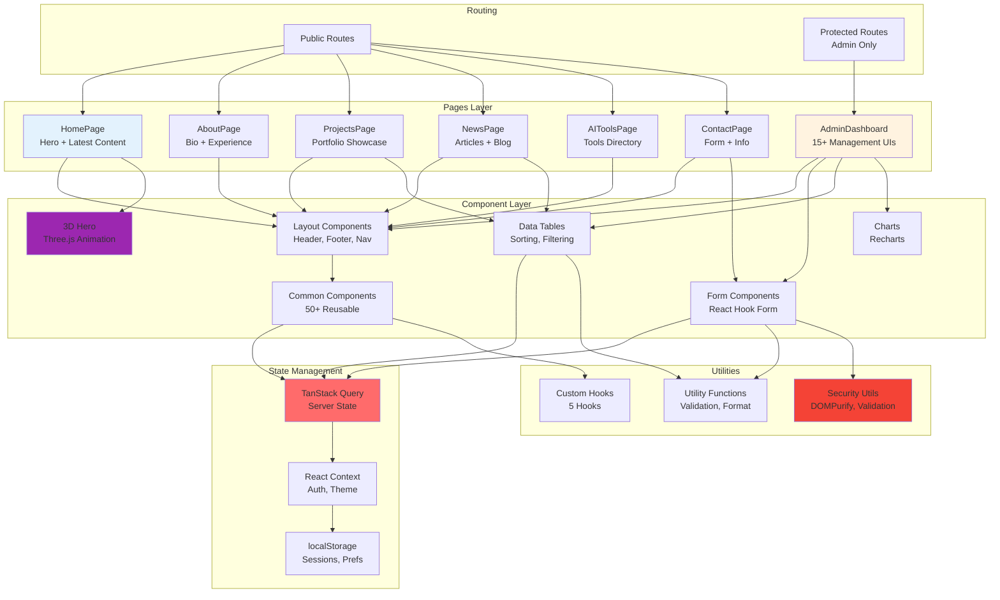

---

## 3. Backend Architecture

```mermaid
graph TB
    subgraph "Edge Functions Layer"
        AdminAuth[admin-auth<br/>Login, Sessions, 2FA]
        AIContent[ai-content-generator<br/>OpenAI Integration]
        AmazonPipeline[amazon-article-pipeline<br/>Product + Article Gen]
        GenArticle[generate-ai-article<br/>News Scraping + AI]
        GenSocial[generate-social-content<br/>Social Media Posts]
        Maintenance[maintenance-runner<br/>Scheduled Tasks]
        Newsletter[newsletter-signup<br/>Email Management]
        Webhook[send-article-webhook<br/>Make.com Integration]
        Contact[send-contact-email<br/>Contact Form Handler]
        TestAPI[test-api-setup<br/>Diagnostics]
        TrackClick[track-affiliate-click<br/>Analytics]
    end

    subgraph "Database Layer"
        Content[(Content Tables<br/>articles, projects, ai_tools)]
        Admin[(Admin Tables<br/>users, sessions, activity)]
        Commerce[(Commerce Tables<br/>products, clicks, stats)]
        Support[(Support Tables<br/>tickets, responses, kb)]
        Monitor[(Monitoring Tables<br/>metrics, alerts, logs)]
    end

    subgraph "External Integrations"
        AI[AI Services<br/>OpenAI, Lovable]
        Search[Product Discovery<br/>SerpAPI, Google]
        Email[Email Service<br/>Resend]
        Webhooks[Webhooks<br/>Make.com, Zapier]
    end

    AdminAuth --> Admin
    AIContent --> AI
    AmazonPipeline --> Commerce
    AmazonPipeline --> Content
    AmazonPipeline --> Search
    AmazonPipeline --> AI
    GenArticle --> Content
    GenArticle --> AI
    GenSocial --> Content
    GenSocial --> AI
    Maintenance --> Content
    Maintenance --> Admin
    Maintenance --> Monitor
    Newsletter --> Email
    Webhook --> Webhooks
    Contact --> Email
    TrackClick --> Commerce

    style AdminAuth fill:#ff6b6b
    style AmazonPipeline fill:#4caf50
    style AI fill:#9c27b0
    style Search fill:#2196f3
    style Email fill:#ff9800
```

---

## 4. Database Schema

### 4.1 Entity Relationship Diagram

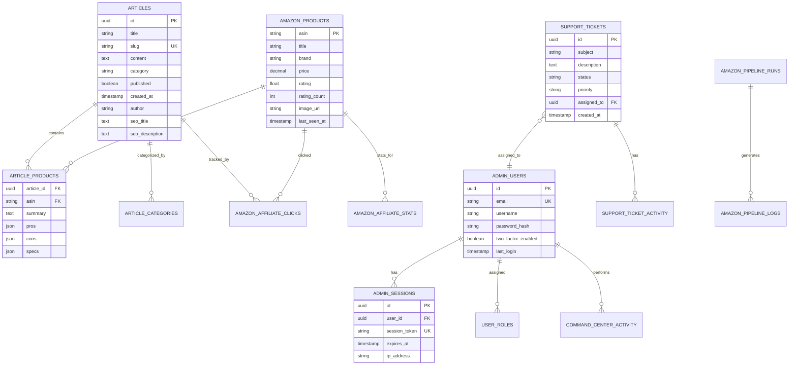

### 4.2 Database Tables by Category

```mermaid
graph TB
    subgraph "Content Management"
        Articles[articles<br/>Blog + News]
        Projects[projects<br/>Portfolio]
        AITools[ai_tools<br/>Tool Directory]
        Categories[article_categories<br/>Taxonomy]
    end

    subgraph "Commerce & Affiliate"
        Products[amazon_products<br/>Product Cache]
        ArticleProducts[article_products<br/>Junction Table]
        Clicks[amazon_affiliate_clicks<br/>Click Tracking]
        Stats[amazon_affiliate_stats<br/>Daily Aggregates]
        SearchTerms[amazon_search_terms<br/>Search Management]
    end

    subgraph "Administration"
        AdminUsers[admin_users<br/>Admin Accounts]
        Sessions[admin_sessions<br/>Active Sessions]
        Roles[user_roles<br/>Permissions]
        Activity[command_center_activity<br/>Audit Log]
        PasswordReset[password_reset_tokens<br/>Reset Tokens]
    end

    subgraph "Communication"
        Newsletter[newsletter_subscribers<br/>Email List]
        EmailLogs[email_logs<br/>Send History]
        SMTPSettings[smtp_settings<br/>Email Config]
    end

    subgraph "Social Proof"
        Testimonials[testimonials<br/>Reviews]
        Profile[profile_settings<br/>Bio + Links]
        Ventures[ventures<br/>Companies]
    end

    subgraph "Support System"
        Tickets[support_tickets<br/>Help Requests]
        Responses[support_ticket_activity<br/>Conversations]
        KB[knowledge_base_articles<br/>Help Docs]
        Canned[canned_responses<br/>Templates]
    end

    subgraph "Monitoring"
        Metrics[system_metrics<br/>Performance]
        Alerts[system_alerts<br/>Notifications]
        Maintenance[maintenance_schedules<br/>Tasks]
        LinkHealth[link_health<br/>URL Monitoring]
        Performance[performance_history<br/>Historical Data]
    end

    subgraph "Pipeline Management"
        Runs[amazon_pipeline_runs<br/>Execution Tracking]
        Logs[amazon_pipeline_logs<br/>Detailed Logs]
        Settings[amazon_pipeline_settings<br/>Configuration]
    end

    Articles --> ArticleProducts
    Products --> ArticleProducts
    Articles --> Clicks
    Products --> Clicks
    Products --> Stats

    AdminUsers --> Sessions
    AdminUsers --> Roles
    AdminUsers --> Activity

    Tickets --> Responses

    Runs --> Logs

    style Articles fill:#bbdefb
    style Products fill:#c8e6c9
    style AdminUsers fill:#ffccbc
    style Newsletter fill:#f8bbd0
    style Tickets fill:#fff9c4
    style Metrics fill:#d1c4e9
    style Runs fill:#b2dfdb
```

---

## 5. Authentication Flow

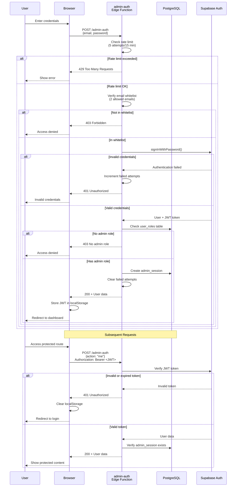

---

## 6. Amazon Article Pipeline Flow

```mermaid
flowchart TD
    Start([Pipeline Triggered]) --> CheckBusy{Pipeline<br/>running?}

    CheckBusy -->|Yes| Busy[Return 429<br/>Pipeline Busy]
    CheckBusy -->|No| CreateRun[Create pipeline_run<br/>Status: running]

    CreateRun --> GetSettings[Fetch pipeline_settings<br/>from database]
    GetSettings --> SelectTerm[Select random<br/>unused search_term]

    SelectTerm --> DiscoverProducts[Product Discovery]

    subgraph "Product Discovery with Retries"
        DiscoverProducts --> TrySerpAPI{Try SerpAPI}
        TrySerpAPI -->|Success| ProcessProducts
        TrySerpAPI -->|Fail| TryGoogle{Try Google<br/>Custom Search}
        TryGoogle -->|Success| ProcessProducts
        TryGoogle -->|Fail| RetryCount{Retry < 5?}
        RetryCount -->|Yes| SelectTerm
        RetryCount -->|No| NoProducts[Log: No products<br/>Update run: failed]
    end

    ProcessProducts[Process Products] --> ExtractASIN[Extract ASINs<br/>from URLs]
    ExtractASIN --> FilterProducts{Apply Filters}

    FilterProducts -->|Price, Rating,<br/>Review Count| ValidProducts[Valid Products]
    ValidProducts --> CacheProducts[Cache in<br/>amazon_products table]

    CacheProducts --> EnrichData[Enrich Product Data<br/>bullet points, specs]
    EnrichData --> GenerateArticle[AI Article Generation<br/>Lovable AI + Gemini 2.5]

    GenerateArticle --> ParseJSON{Parse AI<br/>Response}
    ParseJSON -->|Fail| RetryAI{Retry < 3?}
    RetryAI -->|Yes| GenerateArticle
    RetryAI -->|No| AIFailed[Log: AI generation failed<br/>Update run: failed]

    ParseJSON -->|Success| SaveArticle[Save to articles table]
    SaveArticle --> LinkProducts[Create article_products<br/>relationships]

    LinkProducts --> CreateAffiliate[Generate affiliate URLs<br/>with Amazon tag]
    CreateAffiliate --> UpdateContent[Update article content<br/>with affiliate links]

    UpdateContent --> GenerateSocial[Generate Social Content<br/>Twitter/Facebook posts]
    GenerateSocial --> SendWebhook[Send to Make.com<br/>webhook]

    SendWebhook --> UpdateRun[Update pipeline_run<br/>Status: completed]
    UpdateRun --> Success([Return Success<br/>Article + Stats])

    Busy --> End([End])
    NoProducts --> End
    AIFailed --> End
    Success --> End

    style Start fill:#4caf50
    style Success fill:#4caf50
    style Busy fill:#ff9800
    style NoProducts fill:#f44336
    style AIFailed fill:#f44336
    style GenerateArticle fill:#9c27b0
    style DiscoverProducts fill:#2196f3
    style CacheProducts fill:#00bcd4
```

---

## 7. Content Generation Flow

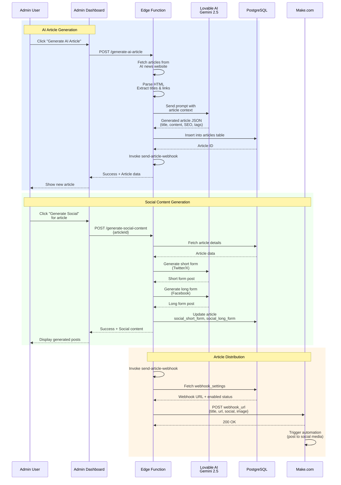

---

## 8. Deployment Architecture

```mermaid
graph TB
    subgraph "Development Environment"
        Dev[Developer Workstation]
        Git[Git Repository<br/>GitHub]
    end

    subgraph "Build & CI/CD"
        Actions[GitHub Actions<br/>(optional)]
        Build[Build Process<br/>npm run build]
        Test[Test Suite<br/>Vitest]
    end

    subgraph "Cloudflare Platform"
        Pages[Cloudflare Pages]
        CDN[Cloudflare CDN<br/>Global Edge Network]
        DNS[Cloudflare DNS<br/>danpearson.net]
        Workers[Cloudflare Workers<br/>(optional)]
    end

    subgraph "Supabase Platform"
        SBProject[Supabase Project<br/>qazhdcqvjppbbjxzvisp]
        SBDB[(PostgreSQL 15<br/>Database)]
        SBAuth[Authentication]
        SBEdge[Edge Functions<br/>11 Deno Functions]
        SBStorage[Storage<br/>(optional)]
    end

    subgraph "External Services"
        OpenAI[OpenAI API]
        Lovable[Lovable AI]
        SerpAPI[SerpAPI]
        Google[Google Search API]
        Resend[Resend Email]
        Make[Make.com]
    end

    subgraph "Monitoring & Analytics"
        GA[Google Analytics]
        Sentry[Sentry<br/>(Error Tracking)]
        Logs[Supabase Logs]
    end

    Dev -->|git push| Git
    Git -->|trigger| Actions
    Actions --> Test
    Test -->|success| Build
    Build -->|deploy| Pages

    Pages --> CDN
    DNS --> CDN
    CDN -->|serve static| Pages

    Dev -->|supabase deploy| SBProject
    SBProject --> SBDB
    SBProject --> SBAuth
    SBProject --> SBEdge

    Pages -->|API calls| SBEdge
    Pages -->|auth| SBAuth

    SBEdge --> SBDB
    SBEdge --> OpenAI
    SBEdge --> Lovable
    SBEdge --> SerpAPI
    SBEdge --> Google
    SBEdge --> Resend
    SBEdge --> Make

    Pages --> GA
    Pages -.errors.-> Sentry
    SBEdge --> Logs

    style Dev fill:#e3f2fd
    style Pages fill:#f9f871
    style CDN fill:#f9f871
    style SBProject fill:#3ecf8e
    style SBDB fill:#336791
    style Build fill:#4caf50
```

---

## 9. API Integration Map

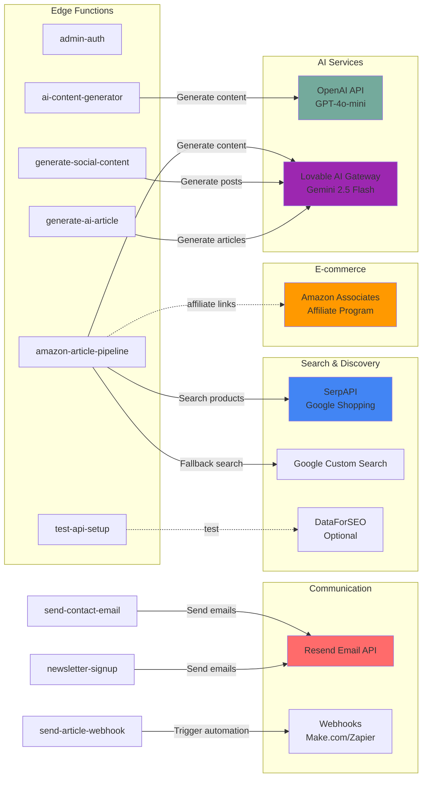

---

## 10. Data Flow Diagrams

### 10.1 User Journey - Public User

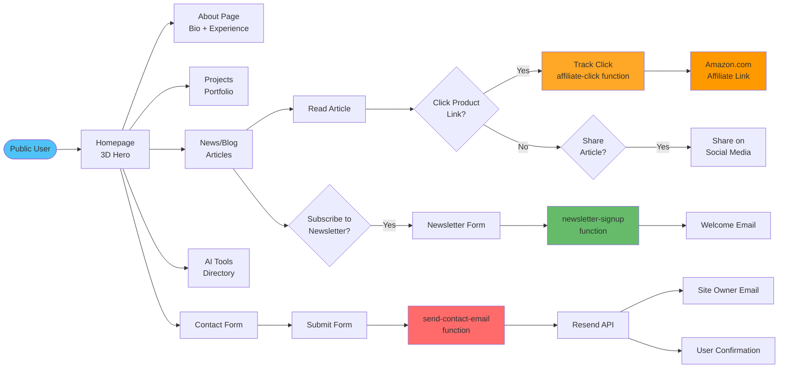

### 10.2 User Journey - Admin User

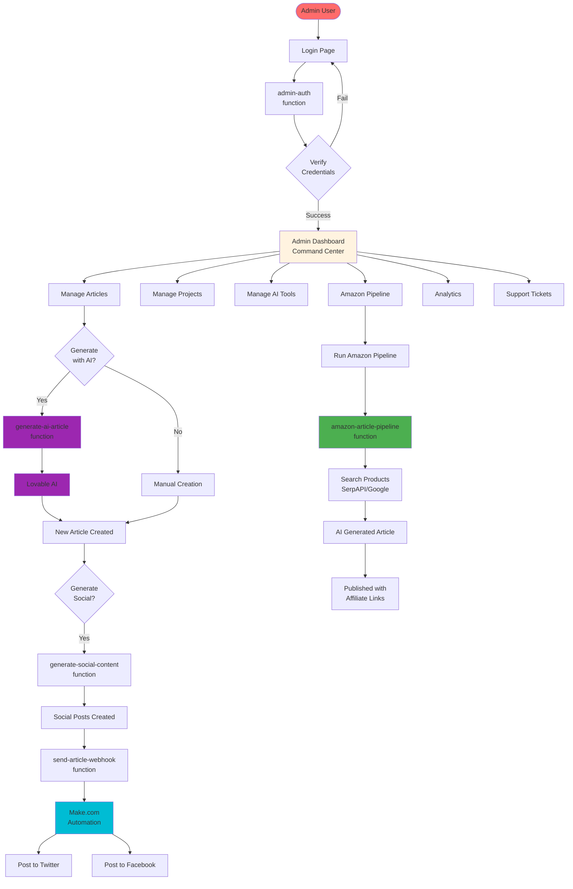

### 10.3 Newsletter Signup Flow

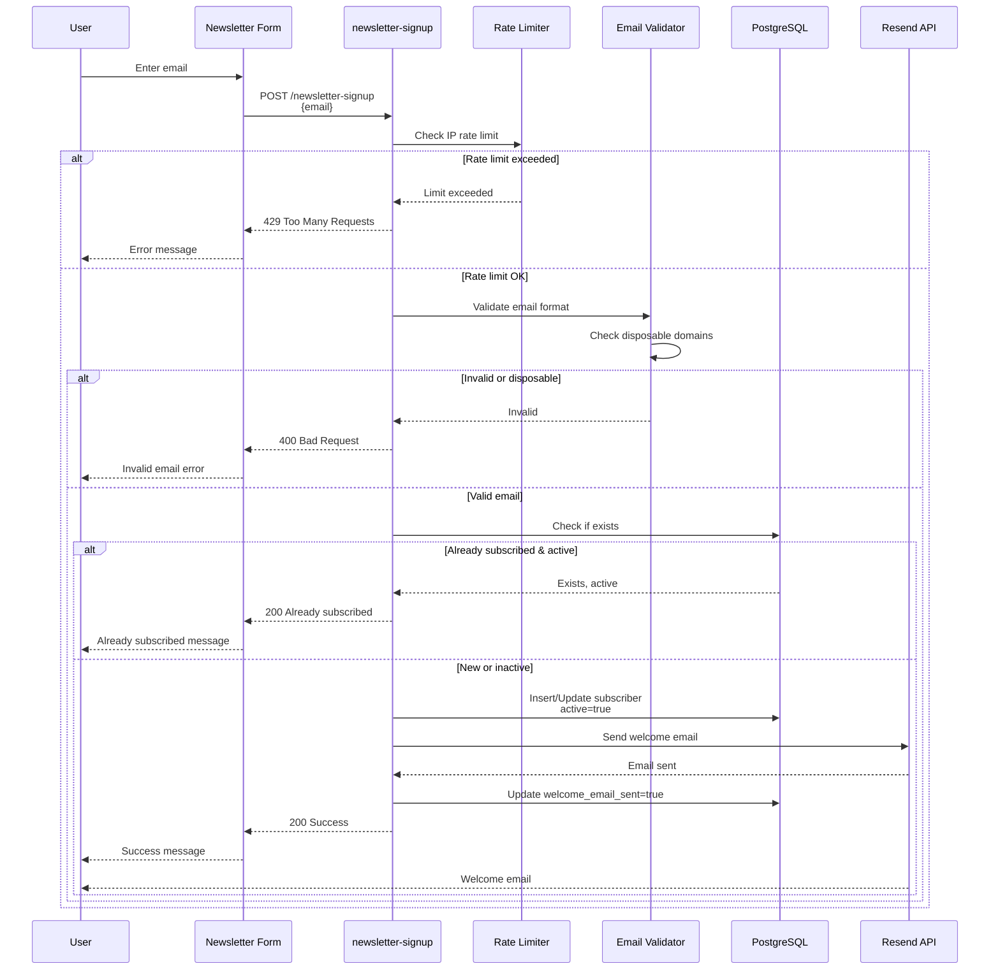

### 10.4 Affiliate Click Tracking Flow

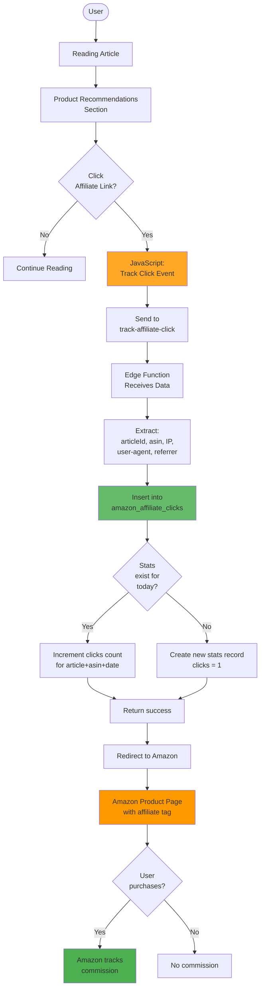

---

## Architecture Notes

### Key Design Principles

1. **Serverless Architecture**
   - No server management required
   - Auto-scaling edge functions
   - Pay-per-execution model
   - Global distribution via Cloudflare

2. **Security-First Design**
   - Row Level Security on all tables
   - JWT authentication with short expiry
   - Input validation and sanitization
   - Rate limiting on sensitive endpoints
   - Content Security Policy headers

3. **Performance Optimization**
   - Code splitting with lazy loading
   - Vendor chunking for large libraries
   - Static asset caching (1-year)
   - TanStack Query for intelligent caching
   - Optimized bundle sizes

4. **Scalability**
   - Stateless edge functions
   - Database connection pooling
   - CDN for static assets
   - Async processing for heavy tasks

5. **Maintainability**
   - TypeScript for type safety
   - Component-based architecture
   - Reusable utility functions
   - Comprehensive error handling
   - Detailed logging

### Technology Decisions

| Aspect | Technology | Rationale |
|--------|------------|-----------|
| Frontend Framework | React 18 | Mature ecosystem, excellent performance |
| Type Safety | TypeScript | Catch errors at compile time |
| Build Tool | Vite | Fast dev server, optimized builds |
| Styling | Tailwind CSS | Utility-first, consistent design |
| UI Components | shadcn/ui | Accessible, customizable |
| State Management | TanStack Query | Server state caching, automatic updates |
| Backend | Supabase | PostgreSQL + Auth + Edge Functions |
| Hosting | Cloudflare Pages | Global CDN, automatic HTTPS |
| AI Services | OpenAI + Lovable | Best-in-class models, cost-effective |
| Email | Resend | Developer-friendly, reliable |

### Future Architecture Considerations

1. **Caching Layer**
   - Redis for session storage
   - CloudFlare Workers KV for edge caching
   - CDN cache optimization

2. **Real-time Features**
   - Supabase Realtime for live updates
   - WebSocket connections for admin dashboard
   - Live support chat

3. **Advanced Analytics**
   - Custom analytics dashboard
   - User behavior tracking
   - A/B testing infrastructure
   - Conversion funnel analysis

4. **Content Delivery**
   - Image optimization service (Cloudinary, imgix)
   - Video hosting integration
   - Multi-CDN strategy

5. **Internationalization**
   - Multi-language support
   - Locale-based content
   - Currency conversion for affiliate links

6. **Mobile App**
   - React Native app
   - Shared API endpoints
   - Push notifications

---

## Diagram Rendering

These diagrams use Mermaid syntax and can be rendered in:

- **GitHub/GitLab**: Native rendering
- **VS Code**: Mermaid Preview extension
- **Online**: mermaid.live
- **Documentation Tools**: GitBook, Docusaurus, MkDocs

To view diagrams locally:
```bash
# Install Mermaid CLI
npm install -g @mermaid-js/mermaid-cli

# Render to PNG
mmdc -i ARCHITECTURE_DIAGRAMS.md -o diagrams.png
```

---

## Related Documentation

- [Living Technical Specification](./LIVING_TECHNICAL_SPECIFICATION.md) - Complete system documentation
- [API Reference](./API_REFERENCE.md) - Detailed API endpoint documentation
- [Deployment Guide](./DEPLOYMENT_GUIDE.md) - Deployment procedures and configuration
- [Deployment Summary](./DEPLOYMENT_SUMMARY.md) - Quick reference deployment guide

---

**Last Updated**: November 11, 2025
**Version**: 1.0
**Maintained By**: Development Team
